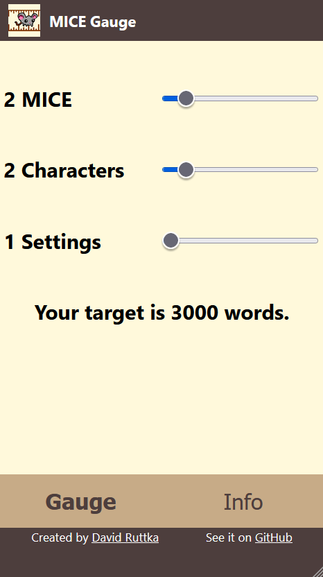

# MICE Gauge

In [this lecture and workshop from Mary Robinette Kowal](https://www.youtube.com/watch?v=blehVIDyuXk), we learn an interesting equation for target story length based on the number of characters, stages, and "MICE" threads.  

This quick progressive web app provides sliders for these factors and estimates a target story length.

## Use it today

Visit [https://mice.davidruttka.com](https://mice.davidruttka.com). Remember that you can install the PWA to avoid future browser navigations!

For [Chrome](https://support.google.com/chrome/answer/9658361?hl=en&co=GENIE.Platform%3DAndroid), [Safari](https://www.howtogeek.com/667910/how-to-add-a-website-to-your-iphone-or-ipad-home-screen/), and [Firefox](https://developer.mozilla.org/en-US/docs/Web/Progressive_web_apps/Installable_PWAs).

## Getting Started

- Clone the repo
- npm i
- npm start
- Browse to [http://localhost:4000](http://localhost:4000)